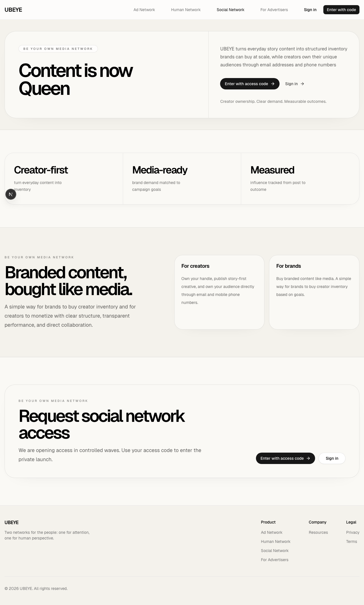
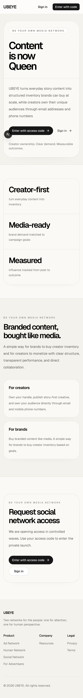

# Social Network v1 Reference Pack

Frozen visual/code reference for the old UBEYE social network concept.

Source snapshot:
- Commit: `1cffc70529f8559eaf0d16308cfedf97475d5d4b`
- Commit title: `feat: ship social network private-launch gating and moderation stack`
- Commit date: March 4, 2026

This pack is for reference only. It is not intended to run as a standalone app.

## What Is Included

- Existing screenshots found in this repo
- Copied TSX source files from the old social-network implementation
- A short flow summary so a new project can understand the intended product

## Screenshots

These are the preserved screenshots I found in the repo. They show the public social-network landing page, not the private in-app story UI.

## Source Snapshot

Copied from the historical commit into `source/`:

- `source/app/social-network/page.tsx`
- `source/app/social-network/enter/page.tsx`
- `source/app/social-network/app/page.tsx`
- `source/app/social-network/app/simple-social-app.tsx`
- `source/app/social-network/claim-username/page.tsx`
- `source/app/social-network/following/page.tsx`
- `source/app/social-network/profile/page.tsx`
- `source/app/social-network/profile/analytics/page.tsx`

## Product Flows

1. Public entry
- Marketing page for the social product
- Private launch entry via access code

2. Identity setup
- Login with existing UBEYE account
- Viewer onboarding required
- Claim a unique username/handle before using the app fully

3. Main app
- Story-first social experience
- "Your story" plus other users' stories
- Full-screen story playback
- Story upload for image/video
- Seen/unseen state

4. Discovery
- "For You" discovery area
- Searchable people directory
- Follow, unfollow, mute, unmute, block, unblock

5. Account pages
- Social profile page
- Following management page
- Analytics page for story views and audience stats

## Best Files To Read First

If the new project only needs a quick orientation:

1. `source/app/social-network/app/simple-social-app.tsx`
2. `source/app/social-network/profile/page.tsx`
3. `source/app/social-network/profile/analytics/page.tsx`
4. `source/app/social-network/following/page.tsx`

## Important Caveat

The old social network was not isolated to one folder. The real implementation also depended on shared auth, Prisma, S3 uploads, rate limiting, moderation, admin pages, and background jobs.

This pack is intentionally narrower. It is here to show the look, user flow, and page structure that the new project should reference.
